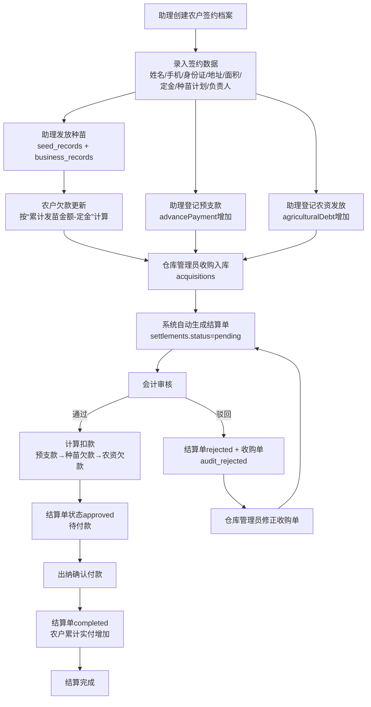
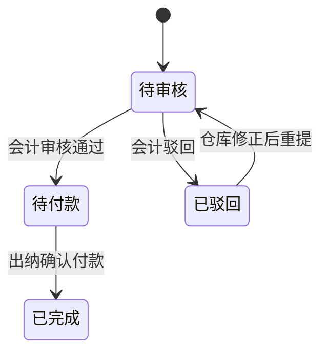

# 普惠农录业务流程说明（财务主线版）

> 目标：用于向甲方说明“从签约到结算付款”的完整业务闭环，重点展示资金流和数据流。

## 1. 业务全景流程图（含财务主线）

---

## 2. 角色分工（避免角色混淆）

- 助理（`assistant`）：执行签约、发苗、预支款登记、农资登记，且只能处理自己 `createBy` 的农户。
- 负责人（`firstManager / secondManager`）：业务归属字段，指副总，不等于助理账号。
- 仓库管理员（`warehouse_manager`）：创建收购单，触发结算单自动生成。
- 会计（`finance_admin`）：审核结算并计算扣款。
- 出纳（`cashier`）：确认付款、登记付款方式与凭条号。
- 管理员（`admin`）：全流程监管与兜底操作权限。

---

## 3. 各环节录入字段与财务影响

### 3.1 农户签约（起点）

录入字段（核心）：
- 基本信息：姓名、手机号、身份证。
- 地址：县/乡镇/村。
- 签约信息：种植面积、定金、种苗总量（万株）、种苗单价（元/万株）、应收款（`seedTotal × seedUnitPrice`）。
- 负责人：`firstManager`（必填）、`secondManager`（可选）。

财务影响：
- 初始化农户资金字段：`seedDebt=0`、`agriculturalDebt=0`、`advancePayment=0`。
- 定金用于抵扣种苗款，且只抵扣一次（通过种苗欠款公式体现）。

### 3.2 发苗登记

录入字段（核心）：
- 发放数量、单价、金额、本次发放面积、领取人、发放日期。

财务影响：
- `seedDebt = max(0, 累计发苗金额 - 定金)`。
- 第一次发苗时会自动先用定金抵扣；后续每次发苗只增加种苗欠款余额。
- 同步写入 `seed_records` 与 `business_records(type='seed')`。

### 3.3 预支款登记

录入字段（核心）：
- 预支金额、日期、备注。

财务影响：
- `advancePayment` 累加。
- 写入 `business_records(type='advance')`，用于后续优先扣回。

### 3.4 农资登记（化肥/农药）

录入字段（核心）：
- 类型（化肥/农药）、品名、数量、单位、单价、金额、发放日期。

财务影响：
- `agriculturalDebt` 累加。
- 同步写入 `business_records(type='fertilizer'/'pesticide')`。

### 3.5 收购入库

录入字段（核心）：
- 收购日期、毛重、皮重、水杂率、单价、备注、仓库。

系统自动计算：
- 水杂重 = `(毛重-皮重) × 水杂率`
- 净重 = `毛重 - 皮重 - 水杂重`
- 收购货款 = `净重 × 单价`

财务影响：
- 新增 `acquisitions(status='confirmed')`。
- 自动创建 `settlements(status='pending')`，扣款字段初始为 0。

---

## 4. 财务主线：结算与付款

### 4.1 会计审核（核心扣款规则）

审核通过时实时读取农户余额并计算：
- 扣款优先级：`预支款 > 种苗欠款 > 农资欠款`
- 公式：
  - `totalDeduction = advanceDeduction + seedDeduction + agriculturalDeduction`
  - `actualPayment = acquisitionAmount - totalDeduction`

审核通过后：
- 结算单：`pending -> approved`（待付款）。
- 农户余额同步减少：`advancePayment`、`seedDebt`、`agriculturalDebt`。

审核驳回后：
- 结算单：`rejected`。
- 收购单：`audit_rejected`（仓库可修正后再提审）。

### 4.2 出纳确认付款

录入字段（核心）：
- 付款方式（现金/微信/银行/其他）、付款备注、凭条号（voucherNo）。

结果：
- 结算单：`approved -> completed`。
- `paymentStatus=paid`。
- 农户累计已付：`stats.totalPaidAmount += actualPayment`。

### 4.3 定金在结算中的位置

- 定金不单独作为“结算扣款项”出现。
- 定金已在种苗欠款侧完成一次性抵扣，不再重复处理。

---

## 5. 状态流转图（甲方重点）

---

## 6. 数据流转（表级别）

| 阶段 | 主写入集合 | 关键更新字段 | 对财务口径影响 |
|---|---|---|---|
| 签约 | `farmers` | `deposit` `seedTotal` `seedUnitPrice` `receivableAmount` | 建立农户资金档案基线（定金用于后续抵苗款） |
| 发苗 | `seed_records` + `business_records` | `farmers.seedDebt` | 提升应扣的种苗欠款 |
| 预支款 | `business_records` | `farmers.advancePayment` | 提升优先扣回金额 |
| 农资 | `business_records` | `farmers.agriculturalDebt` | 提升农资应扣金额 |
| 收购 | `acquisitions` + `settlements` | `acquisitionAmount` `status=pending` | 生成待审核应付基础 |
| 审核 | `settlements` + `farmers` | `totalDeduction` `actualPayment` `status=approved` | 确认本次应付与扣款 |
| 付款 | `settlements` + `farmers` | `status=completed` `paymentStatus=paid` `stats.totalPaidAmount` | 形成已付口径 |

---

## 7. 生动案例（从签约到付款）

> 案例农户：张三（助理李四签约）

### 7.1 签约
- 面积：10亩
- 定金：2,000元
- 种苗计划：10万株
- 种苗单价：1,200元/万株
- 应收款：12,000元

签约后余额：
- `seedDebt=0`
- `advancePayment=0`
- `agriculturalDebt=0`

### 7.2 生产期业务
- 发苗两次合计：8,000元，定金2,000元仅抵扣一次 → `seedDebt=6,000`
- 预支现金：2,000元 → `advancePayment=2,000`
- 发放农资：1,500元 → `agriculturalDebt=1,500`

### 7.3 收购与结算
- 收购净重：3,000kg
- 单价：4元/kg
- 收购货款：12,000元

会计审核扣款（按优先级）：
1) 扣预支款 2,000（剩余可分配 10,000）
2) 扣种苗欠款 6,000（剩余可分配 4,000）
3) 扣农资欠款 1,500（剩余可分配 2,500）

得到：
- `totalDeduction = 2,000 + 6,000 + 1,500 = 9,500`
- `actualPayment = 12,000 - 9,500 = 2,500`

### 7.4 出纳付款
- 出纳按微信转账支付 2,500 元并登记凭条号。
- 结算单状态变为 `completed`。
- 农户累计已付增加 2,500 元。

这就形成了“签约-投入-收购-扣款-付款”的完整财务闭环。

---

## 8. 给甲方的口径建议

- 资金安全：扣款顺序固定，且在审核时实时按农户最新余额计算。
- 数据可追溯：每次业务动作都在 `business_records` 或主业务单据中留痕。
- 角色隔离：助理、仓库、会计、出纳各司其职，减少串岗风险。
- 可扩展：可按负责人、仓库、时间维度做管理报表与审计抽查。
